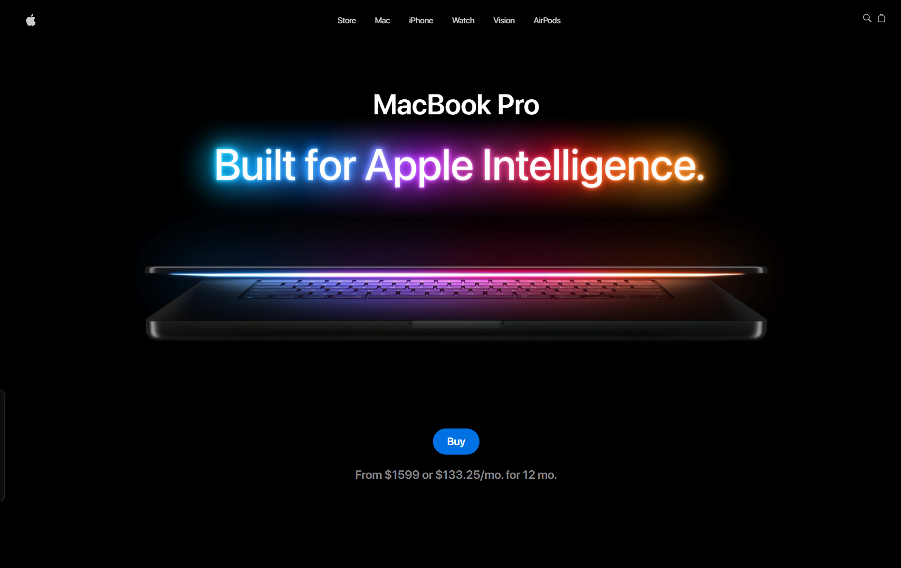

<div align="center">

<!--
  📸 PREVIEW IMAGE
  Add a screenshot or GIF of the live site here, e.g.:
  1. Take a screenshot/GIF of https://macbook-pro-rho.vercel.app/
  2. Save it as `docs/preview.png` (or `.gif`) in the repo
  3. This line will then render it automatically
-->


<h1>🖥️ MacBook Pro — Interactive Landing Page</h1>

<p>
A pixel-perfect, fully interactive recreation of Apple's MacBook Pro landing page —
built with real-time 3D, scroll-driven storytelling, and buttery-smooth animation.
</p>

<p>
  <a href="https://macbook-pro-rho.vercel.app/"><strong>🔗 Live Demo</strong></a>
</p>

<p>
  
  
  
  
</p>
<p>
  
  
  
  
  
</p>

<p>
  
  
</p>

</div>

---

## 📖 About the Project

This project is a **from-scratch, TypeScript-first rebuild** of Apple's MacBook Pro marketing page — originally built along a JavaScript course and then **fully converted to TypeScript** by hand, section by section, to strengthen type-safety and real-world React + Three.js architecture skills.

It combines a real-time, GPU-rendered 3D MacBook model with GSAP-powered scroll storytelling to reproduce the feel of Apple's product pages: cinematic hero video, an interactive product configurator, pinned scroll sections, and scroll-synced texture switching — all running smoothly in the browser.

## ✨ Features

- 🎬 **Cinematic Hero** — Autoplaying hero video with custom playback control
- 🧊 **Real-time 3D Product Viewer** — Fully interactive MacBook model rendered with Three.js / React Three Fiber, staged with a custom `Studio` lighting rig
- 🎨 **Live Color & Size Configurator** — Switch between 14" and 16" models and swap colorways (Space Black / Light Gray) with instant material updates on the 3D model, powered by a global Zustand store
- 📌 **Scroll-Pinned Sections** — GSAP `ScrollTrigger` pins and scrubs sections (`M4`, `Performance`, `Feature`) in sync with scroll position instead of simple fade-ins
- 🎞️ **Scroll-Synced Texture Switching** — The 3D model's material texture swaps automatically as the user scrolls through the Feature section, timed with a GSAP timeline
- 📱 **Fully Responsive** — Breakpoint-aware 3D scale, camera, and layout behavior via `react-responsive`
- ⚡ **Optimized Build** — Vite-powered dev/build pipeline, transformed/compressed `.glb` models

## 🛠️ Tech Stack

| Category | Technology |
|---|---|
| **Framework** | [React 19](https://react.dev/) + [TypeScript](https://www.typescriptlang.org/) |
| **Build Tool** | [Vite](https://vite.dev/) |
| **Styling** | [Tailwind CSS v4](https://tailwindcss.com/) |
| **3D Rendering** | [Three.js](https://threejs.org/) via [@react-three/fiber](https://docs.pmnd.rs/react-three-fiber) + [@react-three/drei](https://github.com/pmndrs/drei) |
| **Animation** | [GSAP](https://gsap.com/) + `ScrollTrigger` + `@gsap/react` |
| **State Management** | [Zustand](https://github.com/pmndrs/zustand) |
| **Utilities** | [clsx](https://github.com/lukeed/clsx) for conditional class composition |
| **Code Quality** | ESLint + TypeScript strict checks, reviewed by **CodeRabbit** after every commit |
| **Deployment** | [Vercel](https://vercel.com/) |

## 📁 Project Structure

```
macbook-landing-page/
├── public/
│   ├── models/              # .glb 3D MacBook models (14", 16", base)
│   ├── videos/               # Hero + feature scroll videos
│   └── fonts/                 # Custom SF Pro–style font family
│
├── src/
│   ├── components/
│   │   ├── three/
│   │   │   ├── Studio.tsx         # Lighting / environment rig for the 3D scenes
│   │   │   └── ModelSwitch.tsx    # Handles 14"/16" model switching + positioning
│   │   ├── models/
│   │   │   ├── Macbook.tsx        # Base model (used in Feature section, video textures)
│   │   │   ├── Macbook-14.tsx     # 14" MacBook Pro model
│   │   │   └── Macbook-16.tsx     # 16" MacBook Pro model
│   │   ├── Hero.tsx            # Landing hero section
│   │   ├── NavBar.tsx          # Top navigation bar
│   │   ├── Product.tsx         # Interactive 3D product configurator
│   │   ├── M4.tsx               # M4 chip showcase (pinned scroll section)
│   │   ├── Performance.tsx     # Performance highlights (pinned scroll section)
│   │   ├── Feature.tsx         # Scroll-synced 3D feature showcase
│   │   ├── HighLight.tsx       # Highlight reel section
│   │   └── Footer.tsx          # Footer
│   │
│   ├── store/
│   │   └── index.ts             # Zustand store (color, scale, active texture)
│   │
│   ├── constants/
│   │   └── index.ts             # Static content: nav links, feature copy, image data
│   │
│   ├── App.tsx                 # Section composition root
│   └── main.tsx                # App entry point
│
├── index.html
├── vite.config.ts
├── tsconfig.json
└── package.json
```

## ⚙️ Getting Started

### Prerequisites

- [Node.js](https://nodejs.org/) 20+
- npm (or your package manager of choice)

### Installation

```bash
# Clone the repository
git clone https://github.com/EslamTaha-Dev/macbook-landing-page.git
cd macbook-landing-page

# Install dependencies
npm install

# Start the dev server
npm run dev
```

The app will be available at `http://localhost:5173`.

## 📜 Available Scripts

| Command | Description |
|---|---|
| `npm run dev` | Starts the Vite dev server with HMR |
| `npm run build` | Type-checks with `tsc -b`, then builds a production bundle |
| `npm run lint` | Runs ESLint across the project |
| `npm run preview` | Serves the production build locally |

## ✅ Code Quality & Review Process

Every commit pushed to GitHub is automatically reviewed by **[CodeRabbit](https://coderabbit.ai/)**, which flags type issues, logic errors, and anything overlooked before merge — on top of strict TypeScript checks and ESLint rules enforced locally.

## 🌐 Live Demo

**[https://macbook-pro-rho.vercel.app/](https://macbook-pro-rho.vercel.app/)**

## 👤 Author

**Eslam Taha**
Front-End Developer · UI/UX & Graphic Designer · Full-Stack MERN Developer in progress

- GitHub: [@EslamTaha-Dev](https://github.com/EslamTaha-Dev)

---

<div align="center">

**[#FromOutsideTheUniverse](https://www.linkedin.com/search/results/all/?keywords=%23fromoutsidetheuniverse&origin=HASH_TAG_FROM_FEED)**

</div>